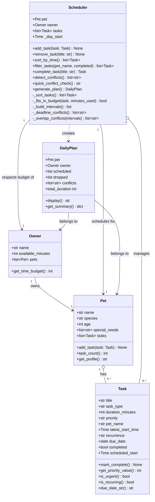

# PawPal+

**PawPal+** is a smart pet care management app that helps busy owners stay consistent with daily routines. It tracks feedings, walks, medications, grooming, and appointments — then uses a scheduling algorithm to prioritize tasks, detect conflicts, and produce a clear daily plan with reasoning.

---

## Features

- **Add a pet and owner** — register a pet's profile and the owner's daily time budget
- **Schedule tasks** — add care tasks with duration, priority, deadline, and recurrence
- **Prioritized daily plan** — generates a schedule sorted by deadline and priority, with start times and reasons
- **Recurring tasks** — daily and weekly tasks automatically re-queue their next occurrence when completed
- **Conflict detection** — flags deadline misses, shared deadlines, and overlapping time windows
- **Filter task list** — view tasks by pet or completion status

---

## Getting Started

### Requirements

- Python 3.10+
- Dependencies listed in `requirements.txt`

### Installation

```bash
python -m venv .venv
source .venv/bin/activate        # Windows: .venv\Scripts\activate
pip install -r requirements.txt
```

### Run the app

```bash
streamlit run app.py
```

### Run the CLI demo

```bash
python main.py
```

### Run the test suite

```bash
python -m pytest tests/test_pawpal.py -v
```

---

## How to Use the App

### Step 1 — Set up your owner and pet

Enter the owner's name, available minutes for the day, the pet's name, species, and the time the day starts. Click **Save owner & pet**.

### Step 2 — Add tasks

Fill in the task title, duration, priority, and optionally a latest start time (e.g. `08:00`) and recurrence (`daily` or `weekly`). Click **Add task**.

A live conflict warning appears automatically if any tasks overlap.

### Step 3 — View and manage the task list

Use the **Show** filter to view all, pending, or completed tasks. Tasks are displayed sorted by earliest deadline first, then by priority — matching the scheduler's order.

To mark a task done, select it from the dropdown and click **Mark done**. Recurring tasks will automatically queue their next occurrence.

### Step 4 — Run conflict detection

Expand **Conflict Detection** to run a full check. Three conflict types are reported:
- Deadline miss — a task's sequential start time exceeds its stated deadline
- Shared deadline — two tasks claim the same `latest_start_time`
- Time-window overlap — two tasks have overlapping `[start, end)` intervals

### Step 5 — Generate today's schedule

Click **Generate schedule** to produce the daily plan. Each scheduled task shows its assigned start time, priority, deadline (if set), and recurrence. Dropped tasks and any conflicts are listed below.

---

## Project Structure

```
pawpal_system.py   — core classes: Pet, Owner, Task, Scheduler, DailyPlan
app.py             — Streamlit UI
main.py            — CLI demo script
tests/
  test_pawpal.py   — unit tests
```

---

## Class Diagram (UML)



---

## Scheduling Algorithm

Tasks are scheduled using an **earliest-deadline-first** strategy with priority tie-breaking:

1. Tasks with a `latest_start_time` are sorted earliest deadline first
2. Within the same deadline, higher priority tasks come first (`high` > `medium` > `low`)
3. Tasks with no deadline are placed after all deadline-constrained tasks
4. Tasks are added to the plan in order until the owner's time budget is exhausted
5. Each scheduled task receives an assigned `scheduled_start` time
6. Remaining tasks are dropped with a reason

---

## Tests

| Area | Tests | What is verified |
|---|---|---|
| Sorting | 4 | Chronological order, priority tie-breaking, no-deadline tasks last, empty list |
| Recurrence | 5 | Daily/weekly next occurrence, one-off returns `None`, deadline preserved on re-queue, unknown title |
| Conflict detection | 4 | Shared deadlines, overlapping windows, clean schedule, `quick_conflict_check()` |
| Task management | 2 | `mark_complete()` changes status, `add_task()` increases pet task count |

Run all tests:

```bash
python -m pytest tests/test_pawpal.py -v
```

Demo:


<a href="/course_images/ai110/demo.png" target="_blank"><img src='/course_images/ai110